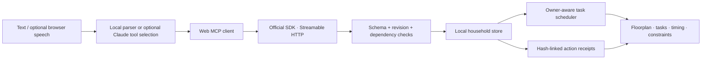

# Threshold

**A little less to carry.** A household departure assistant that remembers different needs, shares the work, and changes the plan when real life changes.

The memorable moment: the elevator breaks. Threshold keeps Sam's step-free preference, switches to the garden ramp, and recomputes the time. Then it starts raining. A rain-cover task appears in the dependency graph before the household can be ready. Nobody has to repeat the whole morning to the next caregiver.

Built for the **Alexa+ track of Build, Ship, Shape: Amazon Developer Hackathon** during September 2026. This is a working web simulation backed by a real MCP server; it is not a live Alexa deployment. All people, building statuses, and device effects are synthetic.

## Run in one minute

Requires Node.js 22 or newer. No API key, AWS account, hardware, or build step is required for the core demo.

```sh
npm ci
npm start
```

Open **http://127.0.0.1:4318**. Choose **Plan our library morning**, or open **http://127.0.0.1:4318/?demo=1** to create the first plan automatically if none exists.

```sh
npm test
npm run check
```

The server binds to loopback only. Local state persists in `data/household.json`, which is ignored by Git. **Reset rehearsal** resets this synthetic data. Stop the process with Ctrl+C. `PORT` and `THRESHOLD_DATA` are optional environment overrides.

## Try the complete story

1. Plan to be **outside the building by 08:30**. The rehearsal clock is fixed at 08:12; these are planning estimates, not a running clock or a library-arrival prediction.
2. Confirm **Collect the library books** and **Fill the water bottle**. Packing the shared bag becomes available only after both.
3. Say or click **The elevator is out**. The route changes to the garden ramp; the step-free requirement and completed work remain.
4. Say **It's raining now**. A rain-cover task becomes a prerequisite for meeting at the threshold.
5. Say **Alex can take over Sam's tasks**. The owner changes only for unfinished work, and the schedule accounts for the extra workload.
6. Say **Turn on a quiet cue**. The virtual hallway light glows; the action gets a receipt. **Undo** restores the earlier light state.
7. Open **Receipts** to inspect actual tool names, revisions, hash-linked receipts, and the negotiated MCP version. Reload the page: the context and plan survive.

Checking a task is a person's explicit confirmation. The assistant does not infer that someone packed a bag simply because it made a plan.

The UI supports text, keyboard, large check controls, reduced motion, and optional browser speech input when the browser exposes it. Browser speech may use the browser vendor's speech service. The demo is fully operable without a microphone. Alexa+ voice rendering is simulated, not impersonated.

## Optional real language understanding

The no-key mode is visibly labeled **Local demo parser**. It recognizes the supported rehearsal phrases; it is not presented as model inference.

To interpret more natural phrasing, provide an Anthropic API key through your environment or secret manager:

```sh
# Set ANTHROPIC_API_KEY in your shell or secret manager; never in source.
THRESHOLD_MODEL=claude-sonnet-5 npm start
```

On the author's workstation the scoped launcher is:

```sh
hsec exec --only ANTHROPIC_API_KEY -- npm start
```

`src/interpret.js` uses the Messages API's actual tool selection. The model receives the typed request and synthetic household state. It returns a tool proposal; the web client executes it through `/mcp`. The store validates arguments, revisions, dependencies, and reversals independently. Keys remain in the server process. Errors never print provider credentials.

On September 21, 2026, live `claude-sonnet-5` calls selected the correct tools for an elevator outage expressed as “the lift has stopped working” and a quiet visual cue expressed as “make the hallway glow gently without a sound.” This is a two-case integration check, not a general accuracy benchmark.

## Real MCP, small surface

Endpoint: **http://127.0.0.1:4318/mcp**. Transport: **Streamable HTTP**. Tested negotiated protocol: **2025-11-25**. Implementation: official `@modelcontextprotocol/sdk` 1.30.0. A fresh server/transport handles each stateless request; household state is stored independently.

| Tool                | Effect                                                             |
| ------------------- | ------------------------------------------------------------------ |
| `get_household`     | Read sourced context, tasks, readiness, devices, and receipts.     |
| `plan_departure`    | Build the library preparation graph and assign owners.             |
| `update_constraint` | Record a changed fact and source, then rebuild the plan.           |
| `complete_task`     | Record explicit human confirmation after dependencies pass.        |
| `handoff_tasks`     | Reassign unfinished work and recompute owner-aware timing.         |
| `set_departure_cue` | Change the local virtual lamp, with a reversible receipt.          |
| `undo_action`       | Restore eligible earlier state without overwriting a newer change. |

Every mutation takes `expectedRevision` and a unique `requestId`. Stale actions fail. Identical retries return the same receipt instead of executing twice. Reusing an ID with different arguments fails. The read-only `threshold://household/current` resource exposes the same household snapshot.

For a compatible host, configure a Streamable HTTP server URL at `/mcp`; the host must be able to reach this loopback endpoint. [Host instructions](docs/AGENT-INTEGRATION.md) describe the calling sequence. Direct Alexa+ onboarding, OAuth, and production hosting have not been completed or tested.

## Architecture



`src/household.js` owns the domain. It schedules prerequisites before dependents and serializes unfinished tasks belonging to the same person. When a changed constraint adds a prerequisite, an already completed terminal task is invalidated. A missing accessible route never silently becomes a stair route. The virtual device adapter only offers warm/off, making its effects small and reversible.

The receipt chain makes application changes inspectable and detects accidental edits against a retained chain. It is not a security-grade, externally anchored audit log: someone who can rewrite the whole file can also recompute its hashes. JSON is written to a temporary file and atomically renamed. This prototype supports one server process; it does not implement multi-process locking or a multi-household tenant boundary.

## Evidence and honest limits

- Eleven automated tests pass, including official MCP client interoperability, protocol negotiation, resources, Origin/Host rejection, blocked dependencies, inaccessible routes, changed prerequisites, persistence, safe undo, idempotency, and owner scheduling.
- The web UI was inspected in the Codex integrated browser. Elevator outage visibly selected the garden ramp; rain added a required rain-cover step and changed timing.
- Two live optional model calls passed as described above.
- No physical household device, Alexa account, weather service, location API, building sensor, or delivery service is connected. Sources explicitly identify fixtures and user reports.
- The only implemented trip template is a library departure. Durations are illustrative estimates. There is no medical, emergency, access-control, or building-safety certification.
- The server is a local single-user prototype. It checks Origin and Host and binds to loopback, but has no production OAuth. Do not expose it publicly unchanged.

## Submission materials

[Demo script](docs/DEMO-SCRIPT.md) · [Project description](docs/SUBMISSION.md) · [Product feedback](docs/FEEDBACK.md) · [Host integration](docs/AGENT-INTEGRATION.md)

All original application code and illustrated SVG artwork were created for this entry. The reusable hackathon planning framework informed prioritization; no prior project's implementation or private household data was copied. See [LICENSE](LICENSE) and [THIRD_PARTY_NOTICES.md](THIRD_PARTY_NOTICES.md).

Primary references: [Amazon hackathon rules](https://amazonappdev2026.devpost.com/rules), [MCP 2025-11-25 Streamable HTTP](https://modelcontextprotocol.io/specification/2025-11-25/basic/transports), [official TypeScript SDK](https://github.com/modelcontextprotocol/typescript-sdk), [Claude models](https://platform.claude.com/docs/en/models/overview). Requirements and model ID were checked September 21, 2026.
